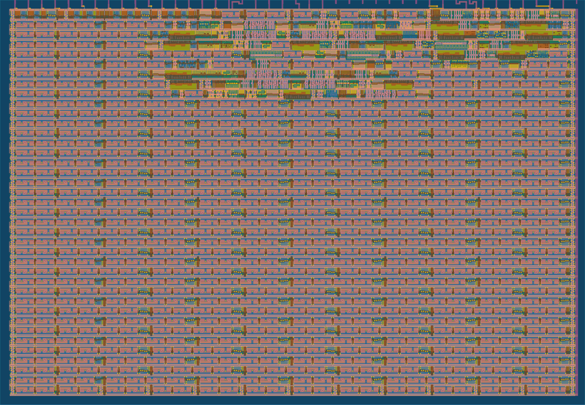

  

# Fibonacci Sequence Generator for Columbus SSCS/CAS Workshop
This is a demonstration Tiny Tapeout project for the workshop series held by the
[Columbus chapter of IEEE SSCS/CAS](https://r2.ieee.org/columbus-ssccas/blog/2024/01/14/tiny-tapeout-workshop-announcement/).
The goal of this project is to demonstrate the Tiny Tapeout flow starting from
a Verilog design to build a GDS file for manufacturing. The project itself is
quite simple, it generates the Nth number from the Fibonacci sequence by iteratively
building the sequence each time. For more information look in [info.md](docs/info.md),
but a schematic of the design is shown here.


The design is quite simple and only uses about 9.5% of the avalible Tiny Tapeout tile area as shown in the GDS render.



# Testbenches
The project includes two methods to test its functionality; with testbenches written in Python cocotb
[cocotb testbench](https://github.com/sellicott/sellicott_fib_seq/blob/main/test/test.py)
(for Github action based simulation) and Icarus Verilog simulation
[testbench code](https://github.com/sellicott/sellicott_fib_seq/blob/2b37c8f3a4a0e91710801dfd6ce39c19cdcebc35/test/tb.v#L46)
for use on local computers.

> [!NOTE]
> Icarus Verilog is used for local simulation since the
> [OSS-CAD-Suite](https://github.com/YosysHQ/oss-cad-suite-build?tab=readme-ov-file) don't currently install a working
> cocotb implementation on Windows. As we desire to have participants build custom testbenches on their local computers
> in future workshops, we needed a testbench platform that can be easily used without installing additional tools beyond
> the basic ones provided in the binary distribution. For Verilog syntax highlighting,
> I'm using the [Verilog-HDL/SytemVerilog/Bluespec SystemVerilog Extension](https://open-vsx.org/vscode/item?itemName=mshr-h.veriloghdl)
# Getting Started
The following instructions describe how to get the tools needed to simulate this project locally on your computer

> [!TIP]
> We assume that the reader has a basic understanding of how to use git and and have a text editor with reasonable
> syntax hilighting. If you don't, I recommend using [VS Code](https://code.visualstudio.com/) and following their
> tutorial on using [git within VS Code](https://code.visualstudio.com/docs/sourcecontrol/intro-to-git).

1) Clone this repo: Use git to download this project to somewhere on your computer.
```
git clone https://github.com/sellicott/sellicott_fib_seq.git
```
> [!NOTE]
> If you plan on modifying the design instead of just looking at it, you should
> ["fork"](https://docs.github.com/en/pull-requests/collaborating-with-pull-requests/working-with-forks/fork-a-repo)
> the repo instead of cloning it. This will allow you to push your own changes to Github to run the tests and OpenLane
> in Github actions.

2) [Install OSS-CAD-Suite](https://github.com/YosysHQ/oss-cad-suite-build?tab=readme-ov-file#installation):
This process will be slightly different depending on your OS. The basic instructions are to download one of the.
[pre-compiled releases](https://github.com/YosysHQ/oss-cad-suite-build/releases) for your operating system/processor
type, then extract the file to a location of your choosing.

> [!CAUTION]
> On Windows, make sure to extract the binaries to a path without spaces. Some of the tools are picky about this.
> I recommend `C:\oss-cad-suite`

3) Startup the CAD Tools Environment: Open up a terminal window (on Windows this is "Command Prompt") and activate
the OSS-CAD-Suite environment by calling the activate script for your OS. For Linux/Mac this will be:
```bash
source <extracted_location>/oss-cad-suite/environment
```
For Windows it will be
```cmd
<extracted_location>\oss-cad-suite\environment.bat
```
If you installed to the recommended location for Windows:
```cmd
C:\oss-cad-suite\environment.bat
```
At this point your command prompt should change to either `(OSS CAD Suite) <prompt>` or 
`[OSS CAD Suite] <prompt>` for Linux/Mac and Windows respectively. At this point you can access any
tools provided by the suite.


